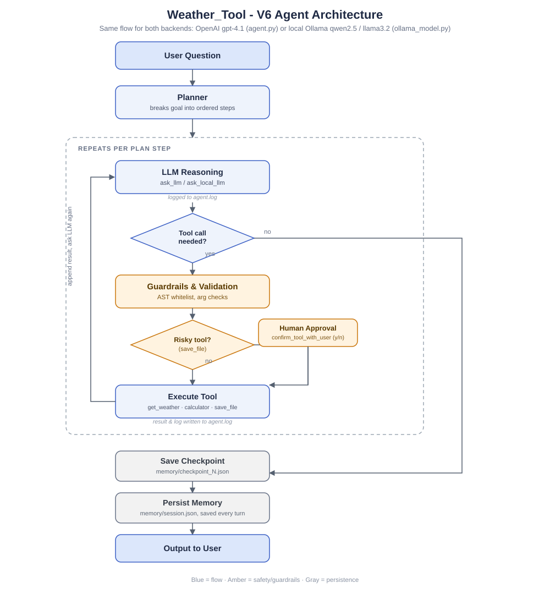

# Weather_Tool

A from-scratch agentic AI system built incrementally through six versions, each adding one core agent capability. No framework (no LangChain/LangGraph) - everything is hand-built directly on top of the OpenAI Python SDK (and, for the local variant, the Ollama Python SDK) to understand what's happening under the hood.

## Version History

| Version | Capability added |
|---|---|
| V1 | Rule-based agent, no LLM, single hardcoded weather tool |
| V2 | LLM-driven tool calling (LLM decides whether to call `get_weather`) |
| V3 | Conversation memory (`self.messages` persists across turns in a session) |
| V4 | Multi-tool support via a tool registry + dynamic dispatch (`TOOLS[tool_name]`) |
| V5 | Planning - a separate planner LLM call decomposes a goal into ordered steps before execution |
| V6 | Production hardening: persistent memory (disk), guardrails (safe calculator), human-in-the-loop approval for risky tools, structured logging, checkpointing |

## Setup

1. Clone the repo and `cd` into it.
2. Create a virtual environment and install dependencies:

   ```bash
   python3 -m venv venv
   source venv/bin/activate
   pip install -r requirements.txt
   ```

3. Create a `.env` file in the project root with your OpenAI API key:

   ```
   OPENAI_API_KEY="sk-..."
   ```

   `.env` is git-ignored - never commit it.

4. (Optional) Want to run fully offline without an OpenAI key? See [Running Locally with Ollama](#running-locally-with-ollama) below.

## Usage

Run the agent:

```bash
python main.py
```

You'll be prompted for a question (e.g. "What's the weather in Seattle?"). The agent plans the request into steps, executes them (calling `get_weather`, `calculator`, and/or `save_file` as needed), and prints the results. Saving a file requires interactive approval since it's flagged as a risky tool. Keep entering follow-up questions, or press Enter on an empty line to end the session - conversation history is saved to `memory/session.json` for next time.

## Running Locally with Ollama

`ollama_model.py` is a full local-model equivalent of the agent, built to match `main.py`/`agent.py` feature-for-feature but running against a local [Ollama](https://ollama.com/) model instead of the OpenAI API - no `OPENAI_API_KEY`, no internet dependency for the LLM call, no API cost.

### Setup

1. Install Ollama itself (the local model server, separate from the `ollama` pip package): download from https://ollama.com/download and make sure it's running.
2. Pull a model:

   ```bash
   ollama pull qwen2.5:7b
   ```

   `qwen2.5:7b` is the default (`MODEL_NAME` in `ollama_model.py`) - it's noticeably more reliable at structured tool calling than `llama3.2`. You can swap to `llama3.2` for a smaller/faster model at the cost of reliability (`ollama pull llama3.2`, then edit `MODEL_NAME`).

3. Install dependencies if you haven't already - `requirements.txt` already includes the `ollama` Python client:

   ```bash
   pip install -r requirements.txt
   ```

4. Run it:

   ```bash
   python ollama_model.py
   ```

Same interactive flow as `main.py`: ask a weather question, approve `save_file` calls when prompted, press Enter on an empty line to exit.

### What it reuses vs. reimplements

Directly imported and reused, unchanged, from the rest of the project:
- `TOOLS`, `confirm_tool_with_user()`, `execute_tool_safely()` from `tool_register.py` - including the real `get_weather`, `calculator`, and `save_file` implementations.
- `save_memory()` / `load_memory()` from `memory.py`, pointed at its own file `memory/ollama_session.json` (kept separate from `memory/session.json` since Ollama's tool-call message shape differs slightly from the OpenAI SDK's).
- `log_info()` from `log.py`, tagged `[OLLAMA]` in `agent.log` so local-model runs are distinguishable from OpenAI runs sharing the same log file.

Reimplemented locally rather than imported: the tool-schema definitions, the planner, and the LLM-calling/orchestration loop. This is deliberate - `llms.py` and `planner.py` both transitively import `config.py`, which constructs the OpenAI client at import time and would break "fully offline" the moment either module was imported.

### Extra reliability layers (local models need more scaffolding than GPT-4.1)

- **Step-restricted tools** - each plan step only sees the tool(s) its own description actually calls for (e.g. a "get weather" step never has `save_file` available), preventing premature or out-of-order saves.
- **Input validation** (`validate_tool_args`) - catches malformed tool args before execution: a `city` that looks like a list, a `calculator` expression that tries to call another tool inside it, or a `save_file` call with no real data in it.
- **Plan repair** (`_ensure_save_step`) - if the user asked to save/report something but the local planner's generated plan dropped the save step, one is force-appended in code.
- **Retry nudge** - if a save-designated step ends with the model describing "I'll save this" without actually calling `save_file`, it gets one explicit corrective retry before giving up.
- **Checkpointing** - `memory/ollama_checkpoint_N.json` written after each completed plan step (kept separate from the OpenAI version's `memory/checkpoint_N.json`).

### Known limitations

Even with all of the above, local models - including `qwen2.5:7b` - are meaningfully less reliable than `gpt-4.1` at multi-step tool orchestration. Observed failure modes that the current guardrails do **not** fully solve:
- A step can call the *correct* tool with a *plausible but wrong* argument (e.g. fetching an already-known city again instead of the newly requested one) - validation only catches structurally malformed args, not semantically wrong ones.
- The retry nudge improves the odds of a requested save actually happening, but isn't a guarantee - a sufficiently confused model can still ignore the direct instruction and finish without saving.
- Longer conversations (more accumulated history, more prior cities/results) make step-tracking confusion more likely.

## Core Architecture

Every version follows the same loop, just with more sophistication layered on: a planner breaks the request into ordered steps, each step asks the LLM to reason and optionally call a tool, risky tools require human approval, results get logged and checkpointed, and the loop repeats until the plan is done.



### Plain-Text Architecture Diagram

```
                    User Goal
                        │
                        ▼
                     Planner
                        │
                        ▼
                    Steps List
            [Task 1, Task 2, ..., Task n]
                        │
                        ▼
                     Executor
                   (LLM reasons
                   per step, decides
                    which tool if any)
                        │
        ┌───────────────┼───────────────┐
        ▼               ▼               ▼
   Weather Tool   Calculator Tool   Save File Tool
  (get_weather)     (calculator)      (save_file)
        │               │               │
        │               │          Human Approval
        │               │            (y/n gate)
        │               │               │
        └───────────────┼───────────────┘
                        ▼
                Guardrails & Logging
             (arg validation, agent.log)
                        │
                        ▼
              Checkpoint + Persist Memory
          (memory/checkpoint_N.json, session.json)
                        │
                        ▼
                   Final Answer
```

## File Structure

```
Weather_Tool/
|-- main.py              # Entry point - loads memory, runs planner + agent loop (OpenAI)
|-- agent.py             # WeatherAgent class - run() and execute_plan() (OpenAI)
|-- planner.py           # create_plan() - decomposes user goal into ordered steps (OpenAI)
|-- llms.py              # ask_llm() (with tools) and ask_llm_with_no_tool() (for planning) (OpenAI)
|-- config.py            # OpenAI client initialization
|-- ollama_model.py      # full local-model equivalent - same feature set, runs via Ollama instead of OpenAI
|-- log.py               # log_info() - structured logging to agent.log
|-- memory.py            # save_memory() / load_memory() - persistent session state
|-- tool_register.py     # TOOLS dict, confirm_tool_with_user(), execute_tool_safely()
|-- tools/
|   |-- weather_tool.py  # get_weather(city) - wraps wttr.in
|   |-- calculator.py    # calculator(expression) - AST-restricted safe eval
|   `-- save_file.py     # save_file(text) - folder/file existence checks, auto-rename
|-- memory/              # persistent sessions + plan checkpoints, both OpenAI and Ollama (git-ignored)
|-- output/              # files written by save_file tool (git-ignored)
|-- architecture.svg     # architecture diagram embedded in this README
|-- requirements.txt
`-- agent.log             # structured run log, shared by both versions (git-ignored)
```

## Guardrails / Safety

- `calculator.py` uses an AST whitelist (only constants, `+ - * /`, and `min`/`max`/`abs`) - no raw `eval()`.
- `save_file` requires interactive user approval (`y`/`n`) before running, since it writes to disk. Any new tool with side effects (email, payments, deletions) should be added to `RISKY_TOOLS` in `tool_register.py`.
- `execute_tool_safely()` wraps every tool call with retry logic (2 attempts) and is the single place tools are invoked from.
- `ollama_model.py` adds an extra `validate_tool_args()` layer on top of all this (see [Running Locally with Ollama](#running-locally-with-ollama)), since local models produce malformed tool calls far more often than `gpt-4.1` does.

## Known Open Items

- No message trimming/summarization mid-session - `self.messages` can grow unbounded within a single long multi-step plan (both versions).
- Checkpoint files (`memory/checkpoint_*.json`, `memory/ollama_checkpoint_*.json`) are written per-step, duplicating data; no `resume_plan()` exists yet to recover from a checkpoint after a crash.
- `executor.py` duplicates plan-execution logic already present in `agent.py`'s `WeatherAgent.execute_plan()` and isn't currently used by `main.py`.
- `ollama_model.py`'s local-model reliability ceiling - see [Known limitations](#known-limitations) above.

## Development Notes

This project is intentionally built without agent frameworks - everything goes through direct SDK calls (`openai` for the main version, `ollama` for the local version), for learning purposes.
